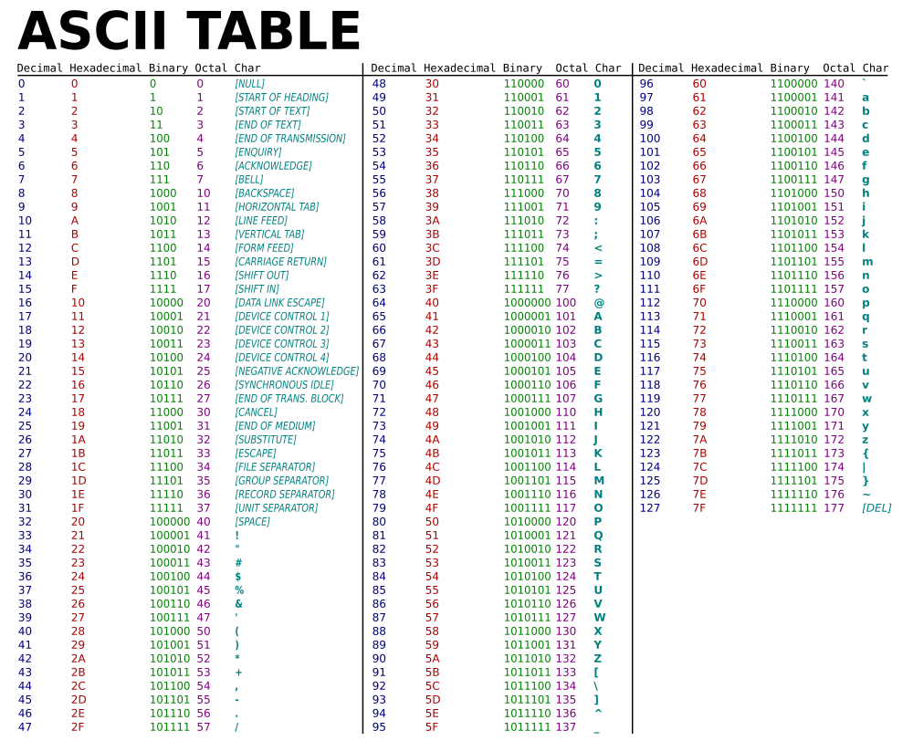

# asciiset

[](https://pkg.go.dev/github.com/elliotwutingfeng/asciiset)
[](https://goreportcard.com/report/github.com/elliotwutingfeng/asciiset)
[](https://codecov.io/gh/elliotwutingfeng/asciiset)

[](LICENSE)

## Summary

**asciiset** is an [ASCII](https://simple.wikipedia.org/wiki/ASCII) character bitset.

Bitsets are fast and memory-efficient data structures for storing and retrieving information using bitwise operations.

**asciiset** is an extension of the **asciiSet** data structure from the Go Standard library [source code](https://cs.opensource.google/go/go/+/master:src/bytes/bytes.go).

Possible applications include checking strings for prohibited ASCII characters, and counting unique ASCII characters in a string.

Spot any bugs? Report them [here](https://github.com/elliotwutingfeng/asciiset/issues).



## Installation

```sh
go get github.com/elliotwutingfeng/asciiset
```

## Testing

```sh
make tests

# Alternatively, run tests without race detection
# Useful for systems that do not support the -race flag like windows/386
# See https://tip.golang.org/src/cmd/dist/test.go
make tests_without_race
```

## Benchmarks

Benchmarks comparing performance between **asciiset** and **map[byte]struct{}** sets are provided.

On average, compared to **map[byte]struct{}** sets, **asciiset** has 13 times the element addition speed, 28 times the lookup speed, and 1.5 times the element removal speed.

```sh
make bench
```
